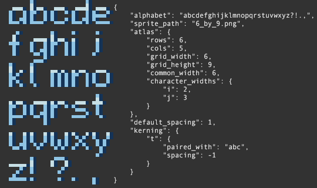

# Font Custom
Create new fonts with Aseprite and load them in to be used in your projects!

All you'll need is a `font atlas` (i.e. a grid-based arrangement of the characters you'd like to use) and a simple `.json` file that describe the properties of the font.

## How to Use Font Custom

1. Create a pixel art font based on a grid with standard height and width. Don't worry about kerning, character widths, and etc; the next step will handle that.
2. Create a properties file with the extension `.json`. The data has to be formatted in a special way, so I recommend using the [example.json](./example.json) file you can find here as a stepping stool.
3. In Aseprite, simply install this extension (only have to do this once) and navigate to `Edit > FX > Use Custom Font` and follow the dialog prompts to include text with your custom font in your Aseprite project!

## Things to Know
1. In your properties file, not every "object" is mandatory. All possible objects are listed below; mandatory objects have a `*` next to them. DO NOT include the asterix in the key-names in your properties file (use [example.json](./example.json) as a template).
    * `*alphabet` - a list of all of the characters found in the font file. Due to technical reasons, the list of characters must _match exactly_ the ordering found in the font file (left to right, top to bottom).
    * `*sprite_path` - a pointer to the sprite file that contains the font. Valid file extensions are `.png`, `.ase`, or `.aseprite`. If a _relative_ file name is given, the extension will look for a font file in the same directory as the property file (recommended). However, you can also give it an _absolute_ file name anywhere on your computer to locate the font file, if desired.
    * `*atlas` - an object containing information relevant to the construction of each character in the alphabet
        * `*rows` - how many rows of letters exist in the font file
        * `*cols` - how many columns of letters exist in the font file
        * `*grid_width` - in pixels, how wide is _exactly one letter_
        * `*grid_height` - in pixels, how tall is _exactly one letter_
        * `common_width` - in pixels, how wide should most characters _be rendered_ (will default to `grid_width` if not specified)
        * `character_widths` - an object containing width information for particular letters (will default to `grid_width` if not specified)
            * every `key` in this object will be _a single letter_ from the `alphabet`; every `value` in this object will be the number of pixels wide that this `key` should be rendered with
    * `default_spacing` - in pixels, the default amount of space to be left in between each letter when rendering (will default to `1` if not specified)
    * `kerning` - an object that specifies spacing between relationships of characters (will default to not use any kerning if not specified)
        * every `key` in this object will be _a single letter_ from the `alphabet`; every `value` will be another object with the form:
            * `*paired_with` - a list of all of the characters, that when appearing _after_ `key`, will have their spacing adjusted by the amount `spacing`
            * `*spacing` - in pixels, how much should the spacing be changed to accomodate the `key` : `paired_with` relationship (can be a negative value) when rendering

2. If you encounter a bug, please report it as an Issue here on this repository! If you are code-saavy, you can also fork this repository and then submit a pull-request.

## Credits

This extension was commissioned by `dani boye` on the [Aseprite Discord server](https://discord.gg/Rt5S6NZFkK)

The json-parsing library, `json.lua`, was provided by `rxi` under the MIT License: https://github.com/rxi/json.lua

As an advocate of open-source software, feel free to suggest edits, or just fork this repository and make your own! The license on this software is open for commercial and private use. This extension will remain free forever; however, if you'd like to buy me a coffee, you can do so [here](https://ko-fi.com/fletchmakesstuff).

